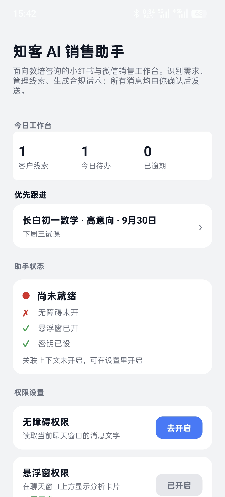
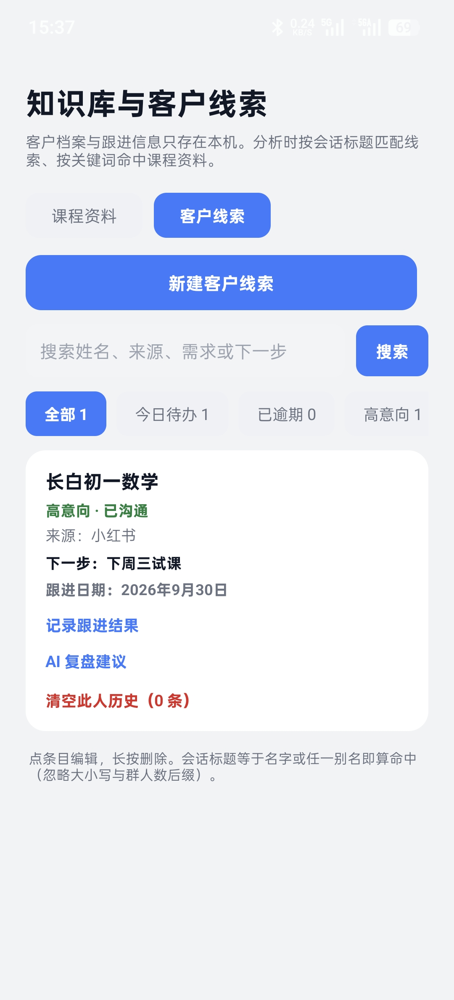
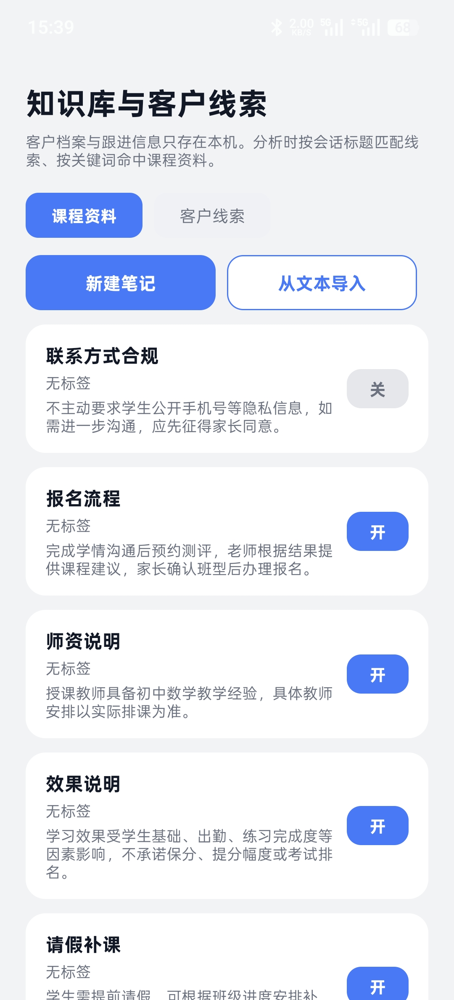
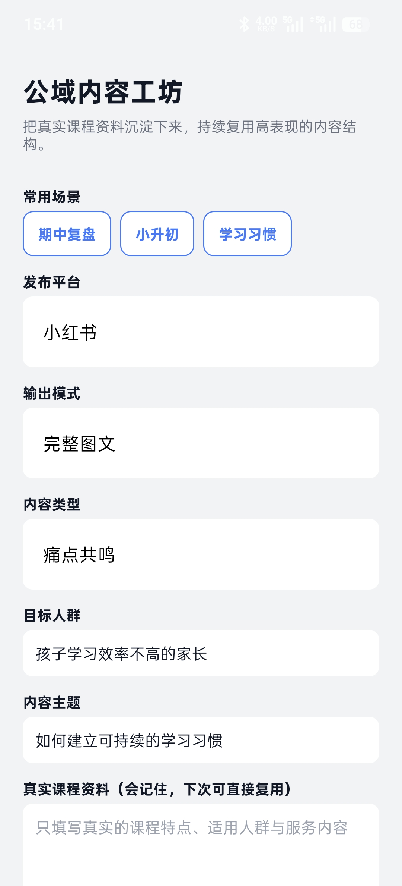
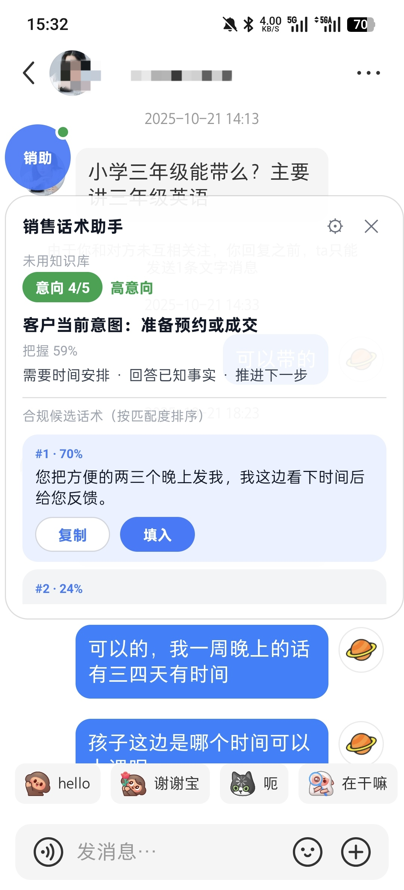
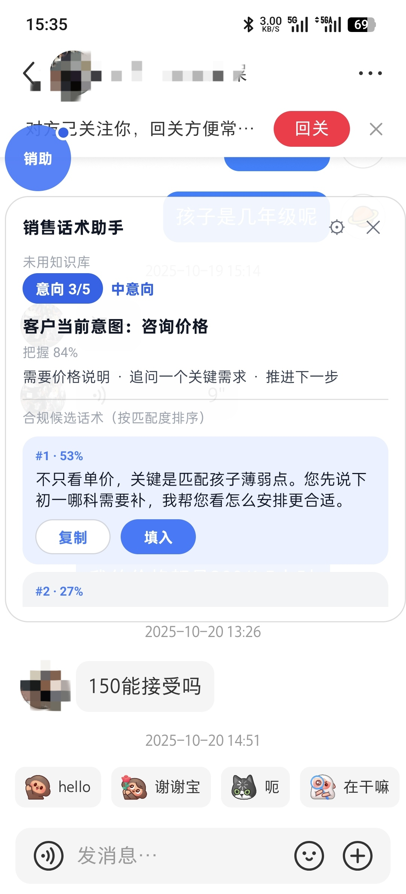
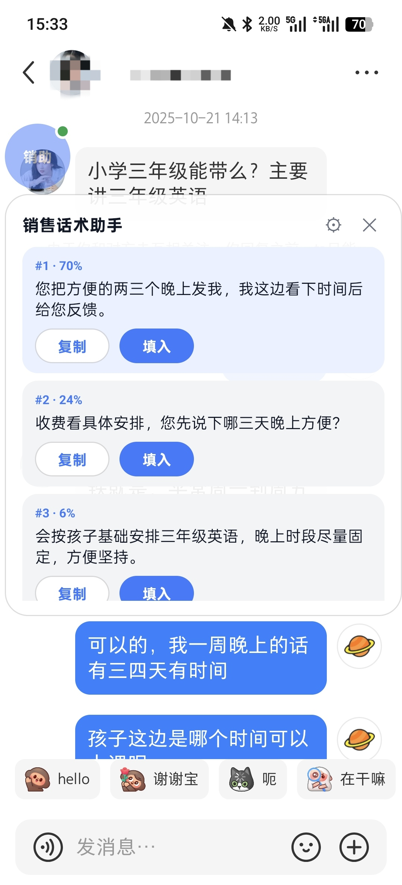

# 知客 AI 销售助手

面向中小教培团队的 Android AI 销售辅助工具。知客在小红书与微信聊天界面旁识别客户需求、购买意向和异议，结合本地课程资料生成候选话术，并在填入前执行合规检查。

消息不会自动发送。销售人员必须在悬浮窗中选择候选内容，再由本人确认发送。

## 运行截图

| 工作台 | 客户线索 |
| --- | --- |
|  |  |

| 课程知识库 | 公域内容工坊 |
| --- | --- |
|  |  |

| 意向分析 | 价格咨询 | 候选话术 |
| --- | --- | --- |
|  |  |  |

## 核心能力

- 小红书、微信私信消息采集与对话方向识别
- 客户意向、诉求、异议和下一步动作分析
- 三种策略的候选销售话术
- 生成后与填入前的双重合规拦截
- 客户线索管理：来源、阶段、意向等级、下一步动作
- 本地课程知识库与可选聊天历史
- 公域内容工坊：生成小红书、朋友圈内容
- 本机 OCR 兜底，不依赖 Google Play 服务

## 产品边界

- 不自动点击发送按钮，不提供无人值守群发
- 不承诺生成内容一定符合所有平台规则，发布前仍需人工审核
- API Key 仅应在 App 设置页中手动填写，禁止写入源码或提交到仓库
- 客户档案、知识库和聊天历史存放在 App 私有目录；聊天历史默认关闭

## 工程信息

- Android 11+
- Kotlin / Android Accessibility Service
- ML Kit 中文 OCR
- OpenRouter、Cloudflare Workers AI 等判断接口
- OpenAI-compatible Chat Completions 回复接口
- 判断、回复、视觉三路模型独立配置

应用 ID：`com.zhike.salesassistant`

当前版本：`0.5.0`

## 使用

1. 安装 APK，并在系统设置中开启知客无障碍服务和悬浮窗权限。
2. 在 App 设置页选择接口预设，填写自己的 API Key、模型和 Account ID（如渠道需要）。
3. 使用“连通测试”验证接口，不要把密钥写入源码。
4. 导入课程资料，在小红书或微信会话中打开悬浮窗。
5. 查看意向分析，选择候选话术填入输入框，人工检查后发送。

## 构建

需要 JDK 17 与 Android SDK 35。

```powershell
$env:JAVA_HOME = "<path-to-jdk-17>"
$env:ANDROID_HOME = "<path-to-android-sdk>"
.\gradlew.bat testDebugUnitTest lintDebug assembleDebug
```

调试包输出：

```text
app/build/outputs/apk/debug/app-debug.apk
```

Release 签名配置必须存放在仓库外，并通过 `ZHIKE_KEYSTORE_PROPS`
环境变量指定属性文件。无签名配置时不会生成可发布的签名包。

## 目录

```text
app/src/main/java/com/zhike/salesassistant/
├── capture/       微信、小红书采集与 OCR
├── core/          配置、数据模型与合规守卫
├── ai/            判断及生成接口客户端
├── overlay/       候选话术悬浮窗
├── MainActivity.kt
├── KnowledgeActivity.kt
├── ContentStudioActivity.kt
└── SettingsActivity.kt
```

## 免责声明

本项目仅提供销售辅助与内容草拟能力，不构成对成交、效果或平台合规的保证。使用者应遵守所在地区法律法规、平台规则和个人信息保护要求，并对最终发送或发布的内容负责。
